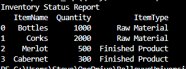
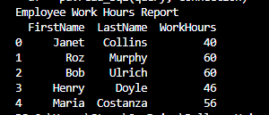
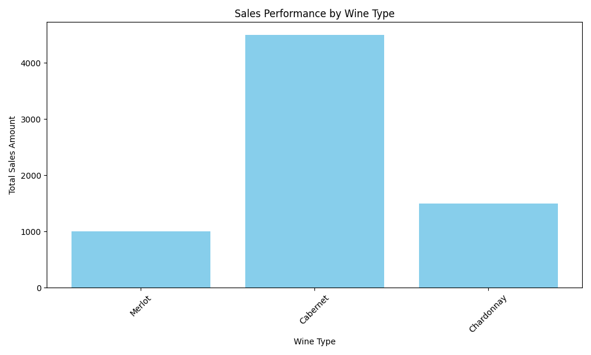

# Operations Data Analysis System

A modular Python application that demonstrates database design, reporting automation, and business analytics using a fictional operations dataset. The project automatically initializes a MySQL database, generates inventory, employee, and sales reports, and visualizes business data while following software engineering best practices such as modular architecture, secure configuration management, and reusable database components.

---

## Features

- Secure MySQL database connection using environment variables
- Automatic database creation and sample data initialization
- Inventory status reporting
- Employee work-hours analysis
- Sales performance analysis
- Automated report generation
- Sales visualization using Matplotlib
- Modular project architecture
- Error handling and database connection management
- Reusable database connection layer

---

## Technologies Used

- Python 3
- MySQL
- MySQL Connector/Python
- Pandas
- Matplotlib
- Python Dotenv
- Git
- GitHub

---

# Project Structure

```text
operations-data-analysis-system/
│
├── src/
│   ├── __init__.py
│   ├── main.py
│   │
│   ├── database/
│   │   ├── __init__.py
│   │   ├── db.py
│   │   └── database_connection.py
│   │
│   └── reports/
│       ├── __init__.py
│       ├── inventory_analysis.py
│       ├── work_hours_analysis.py
│       └── sales_analysis.py
│
├── images/
│   ├── inventory_report.png
│   ├── work_hours_report.png
│   ├── sales_report.png
│   └── sales_performance_report.png
│
├── .env.example
├── .gitignore
├── requirements.txt
└── README.md
```

---

# Project Architecture

```text
                +------------------+
                |    main.py       |
                +--------+---------+
                         |
      +------------------+------------------+
      |                  |                  |
      v                  v                  v
Inventory Report   Work Hours Report   Sales Report
      |                  |                  |
      +------------------+------------------+
                         |
                         v
                  Shared Database Layer
                    (database/db.py)
                         |
                         v
                     MySQL Database
```

---

# Reports Generated

### Inventory Status Report

Displays current inventory records including:

- Item Name
- Quantity Available
- Item Type

---

### Employee Work Hours Report

Displays:

- Employee ID
- Employee Name
- Job Role
- Total Work Hours
- Average Work Hours

---

### Sales Performance Report

Displays:

- Product Sales
- Units Sold
- Total Revenue
- Best Performing Product

---

# Screenshots

## Inventory Report


```markdown

```

---

## Employee Work Hours Report


```markdown

```

---


## Sales Visualization

```markdown

```

---

# Installation

Clone the repository:

```bash
git clone git@github.com:HernandezCui/operations-data-analysis-system.git
```

Navigate into the project directory:

```bash
cd operations-data-analysis-system
```

Install dependencies:

```bash
pip install -r requirements.txt
```

Create a `.env` file:

```text
DB_HOST=localhost
DB_USER=root
DB_PASSWORD=your_password
```

Run the application:

```bash
python3 -m src.main
```

---

# Skills Demonstrated

- Python Programming
- SQL
- MySQL Database Design
- Data Analysis
- Data Visualization
- Reporting Automation
- Secure Configuration Management
- Environment Variables
- Modular Software Design
- Database Management
- Error Handling
- Git Version Control
- GitHub Project Organization

---

# Project Goals

This project was created to demonstrate practical software engineering and data analytics skills by building a modular Python application that:

- Connects securely to a MySQL database
- Automates database creation
- Generates operational reports
- Visualizes business data
- Follows professional project organization
- Uses reusable and maintainable code

---

# Future Enhancements

- Export reports to Excel
- Export reports to PDF
- Interactive Streamlit dashboard
- REST API for report generation
- Docker support
- Automated unit testing with pytest
- GitHub Actions for Continuous Integration
- Logging and monitoring
- User authentication
- Interactive filtering and search

---

# Lessons Learned

During this project, I strengthened my understanding of:

- Database connectivity using Python
- SQL query development
- Modular application architecture
- Environment variable management
- Data visualization techniques
- Python package organization
- Error handling and debugging
- Software project organization using Git and GitHub

---

# Author

**Cuitlahuac Hernandez**

Cybersecurity Student | Python Developer | Data Analytics Enthusiast

I enjoy building software that combines automation, data analysis, and secure application development. This project reflects my interest in writing maintainable Python applications while applying database management and reporting concepts to solve practical business problems.

---

## License

This project is intended for educational and portfolio purposes.